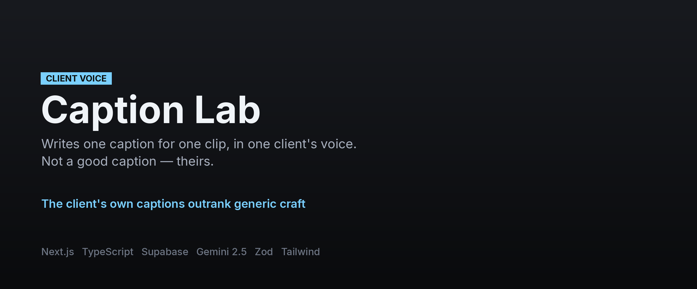
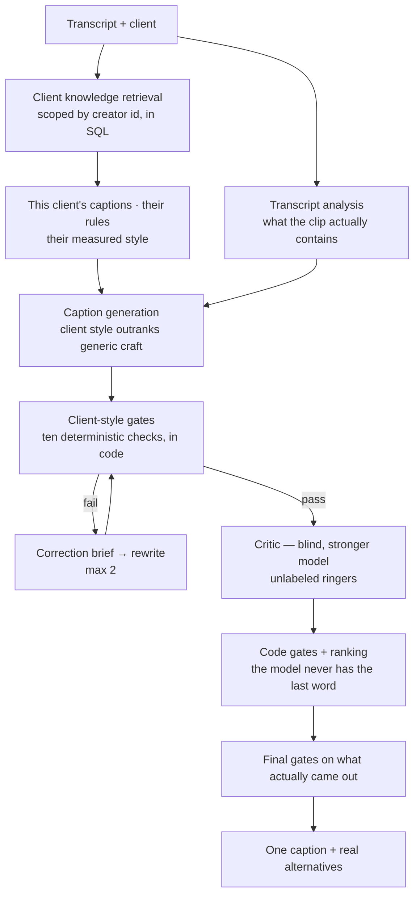

**[← All systems](https://github.com/musabqazi)** · [Hook Lab](https://github.com/musabqazi/hook-lab) · [Cavello Lab](https://github.com/musabqazi/cavello-lab) · [Portfolio](https://github.com/musabqazi/portfolio)

# Caption Lab

**Writes one caption for one clip, in one client's voice. Not a good caption — *theirs*.**

🟢 **In production** · **Client:** content agency (anonymised) · **Source:** private, available on request

## The problem

Two things go in — a transcript and a client — and what has to come back is a caption that client could have posted. That is a harder target than "a good social caption", and the two goals actively conflict: general caption craft pulls every client toward the same competent, interchangeable voice.

So the system needs an authority higher than craft, and it needs that authority to be enforced somewhere a model cannot talk its way around.

## What I built

- **The client's own captions are the highest authority in the system** — above any general theory of what makes a caption good. Their proven captions are stored verbatim, including their own line breaks, spelling and punctuation, because that *is* the style evidence. Tidying it destroys the signal.
- **Ten deterministic client-style gates, in code.** A caption is measured against that client's measured style — not asked about, measured. Fail and the system produces a correction brief and rewrites, up to twice, before anything reaches the judge.
- **A blind critic with unlabeled ringers**, on a stronger model, exactly as in Hook Lab. It offers an opinion; code gates and ranking decide what actually ships.
- **Retrieval scoped by creator id, in SQL.** One client's evidence cannot reach another client's run. This is enforced at the query, not in the interface.
- **The application owns every decision that matters.** The model analyses, writes and has an opinion. Code decides pass or fail, how many retries, whose evidence is used, and what ranks first.

## Architecture

## Stack

## Onboarding a client

Ten of their proven captions is the working minimum for a voice to be inferable. Each is stored with its source URL and transcript where those exist — and where they do not, the field stays empty with the reason recorded rather than invented. That rule matters more than it sounds: a fabricated source is a fabricated style signal.

## My role

Everything: the client-style measurement, the gate layer, the multi-agent pipeline, the per-client scoping model, the retrieval tests, the UI and the deployment.

## Outcomes

- Captions are measured against the client's own evidence in code, so "does this sound like them" stopped being a matter of opinion in a review thread.
- Client isolation is enforced at the database layer — one client's voice cannot leak into another's output.
- Nothing ships on a model's say-so: every caption clears deterministic gates before and after judging.

## A note on what you can see here

The client caption libraries are real client content and are **not published** — the repo ships a synthetic sample and a README describing the expected shape instead. Screenshots are not included because the app sits behind a team access token; happy to demo it live.

---
Part of the <a href="https://github.com/musabqazi">musabqazi portfolio</a> — real systems, anonymised data, source private. © 2026 Musab Qazi
